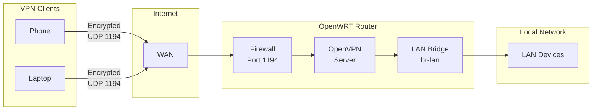
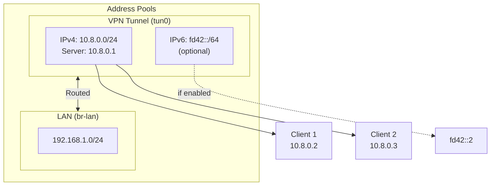

# OpenWRT OpenVPN Server Management

**Version: v2.9.0**

Openwrt VPN setup and management script, making management of Open VPN via CLI much simpler.

The All-in-One OpenVPN Management Script
Tired of managing keys, ovpn files and all different parts piecemeal? Use this script on the CLI to manage it all.

## What's New in v2.9.0

- **Syslog Integration** - All significant actions (PKI init, server.conf generate/restore, client create/revoke/renew, firewall configure, server start/stop/restart, IPv6 enable/disable, instance create/switch) are logged to the system log via `logger`; filter with `logread -e openvpn-mgmt`
- **SSH Disconnect Resilience** - Script now exits cleanly when the SSH session drops (kernel SIGHUP via PTY close) rather than spinning at 100% CPU on a deleted PTY; regression test included
- **Duplicate Session Guard** - Script writes a PID file at startup (`/var/run/openvpn_mgmt.pid`) and refuses to launch a second instance if one is already running
- **sexpect Integration Tests** - 100 tests across 14 suites covering all menu paths; SSH disconnect regression verified on real OpenWrt hardware

## What's New in v2.8.0

- **EC Cryptography Default** - PKI now uses Elliptic Curve (EC) keys with `prime256v1` (NIST P-256) by default; faster key generation on router hardware, no `gen-dh` step required
- **RSA Compatibility Option** - Set `OVPN_CRYPTO_ALGO="rsa"` to use RSA 2048-bit keys for older clients (pre-OpenVPN 2.4, ~2017 and earlier)
- **Crypto Configuration Menu** - New `k) Configure cryptography settings` menu option shows current algorithm, curve/key size, and allows switching before PKI init
- **TLS Hardening** - `tls-version-min 1.2` and `data-ciphers AES-256-GCM` enforced in all generated server configs
- **BusyBox Date Compatibility** - CRL expiry date parsing now uses BusyBox `date -D` strptime format first, with GNU `date -d` and macOS `date -j` as fallbacks

## What's New in v2.7.0

- **CRL Auto-Renewal** - Daily cron job automatically renews the Certificate Revocation List before it expires; prevents the silent outage where an expired CRL locks out all VPN clients including valid ones
- **CRL Management Menu** - New `r) CRL management` option: check expiry, renew manually, install/remove/status of auto-renewal cron job
- **Automatic `crl-verify` Activation** - First client revocation now automatically enables `crl-verify` in `server.conf` and installs the renewal cron job in one step
- **Startup CRL Alert** - Script warns at launch if CRL is expired or within 30 days of expiry
- **Input Validation** - `validate_client_name()`, `validate_non_negative_int()` helpers; client name and bandwidth inputs now validated consistently
- **Destructive Action Timeouts** - 30-second `read` timeout on revoke, stop server, and disable boot confirmations
- **Error Hardening** - `run_cmd` guards on all `uci commit` calls in production paths; server.conf write verified non-empty after generation
- **GitHub Actions CI** - Automated ShellCheck, unit tests (busybox ash), and integration tests; ShellSpec 0.28.1 installed from pinned tarball with SHA256 verification (no pipe-to-shell)

## What's New in v2.6.0

- **OpenWRT 25 Support** - Automatic detection of `apk` (OpenWRT 25+) or `opkg` (older versions) for all package operations
- **Install Required Packages Menu** - New menu option 19 installs `at`, `openvpn-openssl`, and `openvpn-easy-rsa` in one step
- **LuCI File Manager** - Option 6 now also installs `luci-app-filemanager` for easy .ovpn file downloads via the web interface
- **Exit moved to option 20**

## What's New in v2.5.0

- **Server Control Menu** - Centralized start/stop/restart with status checking
- **Safe Restart** - Automatic detection of active client connections before restart
- **Scheduled Restarts** - Schedule restarts using 'at' utility (auto-installed)
- **Connection Awareness** - All restart operations check for active clients
- **Improved Configuration** - User-editable settings organized at top of file
- **Permission Management** - Check and fix PKI file permissions
- **Better Process Detection** - Consolidated PID lookup with accurate matching

## Table of Contents

- [Disclaimer](#disclaimer)
- [Architecture Overview](#architecture-overview)
- [First-Time Setup Guide](#first-time-setup-guide)
  - [Prerequisites](#prerequisites)
  - [Step-by-Step Setup](#step-by-step-setup)
- [Features](#features)
  - [UCI Management Integration](#uci-management-integration)
  - [LuCI Integration](#luci-integration)
  - [OpenVPN Monitoring](#openvpn-monitoring)
- [Quick Reference - Common Operations](#quick-reference---common-operations)
  - [Examine Management Logs](#examine-management-logs)
  - [Revoke a Client Certificate](#revoke-a-client-certificate)
  - [Manage CRL (Certificate Revocation List)](#manage-crl-certificate-revocation-list)
- [Troubleshooting](#troubleshooting)
- [Advanced Usage](#advanced-usage)
- [IPv6 VPN Tunnel Setup](#ipv6-vpn-tunnel-setup)
- [Development and Testing](#development-and-testing)
- [License](#license)

---

## Disclaimer

Tested on OpenWRT v23.05 and v24.10. Older versions may behave unexpectedly.
Compatibility is expected for releases since v20.x.x from https://git.openwrt.org

This project is provided "as-is", without warranty. Users are responsible for
ensuring compatibility and security for their own environment and use case.

---

## Architecture Overview

### Network Flow

How VPN clients connect through your OpenWRT router to access LAN resources:



### Address Pools

IP address pools managed by this script:



---

Assuming you have installed wget...
```
# OpenWRT 24 and earlier:
opkg update
opkg install wget

# OpenWRT 25 and later:
apk update
apk add wget
```
Then if you are SSSH'd into OpenWRT now, grab then run it like this:
```
wget https://raw.githubusercontent.com/beadon/OpenWRTOpenVPNMgmt/refs/heads/main/openvpn_server_management.sh
chmod 775 openvpn_server_management.sh
./openvpn_server_management.sh
```

# First-Time Setup Guide

This guide assumes you're starting from scratch with nothing installed. Follow these steps to get a fully functional OpenVPN server with your first client configuration.

## Prerequisites

1. **Download and run the script:**
   ```bash
   wget https://raw.githubusercontent.com/beadon/OpenWRTOpenVPNMgmt/refs/heads/main/openvpn_server_management.sh
   chmod 775 openvpn_server_management.sh
   ./openvpn_server_management.sh
   ```

   The script will auto-create the default "server" instance on first run.

<details>
<summary><strong>Step-by-Step Setup</strong> (click to expand)</summary>

### Step 1: Install Required Packages

**Menu Option: 1**

```
1) Install required packages (at, openvpn, openvpn-easy-rsa)
Continue with installation? (yes/no): yes
```

This installs the core packages needed to run the script:
- `at` — used for scheduling safe restarts
- `openvpn` — the OpenVPN daemon (resolves to `openvpn-openssl` or `openvpn-mbedtls` depending on your build)
- `openvpn-easy-rsa` — certificate and PKI management

The script automatically uses `apk` on OpenWRT 25+ or `opkg` on older versions.

**Package manager differences:**

| Version | Package manager | OpenVPN package |
|---------|----------------|-----------------|
| OpenWRT 25+ | `apk` | `openvpn` (virtual provider — resolves to `-openssl` or `-mbedtls`) |
| OpenWRT 24 and below | `opkg` | `openvpn-openssl` |

The script detects the package manager at startup and uses the correct package name automatically.

### Step 2: Install LuCI Web Interface (Optional but Recommended)

**Menu Option: 6**

```
6) Install LuCI OpenVPN and File Manager web interface
Continue with installation? (yes/no): yes
```

This installs `luci-app-openvpn` and `luci-app-filemanager` which provide:
- Web-based management interface
- Instance control (start/stop/restart)
- Configuration file editing
- Status monitoring
- File manager for downloading generated client .ovpn files

**Access:** Web Interface → Services → OpenVPN (or System → OpenVPN)
**File Manager:** Web Interface → System → File Manager

**Note:** Changes made in LuCI and this script are synchronized via UCI.

### Step 3: Initialize EasyRSA

**Menu Option: 3**

```
3) Initialize EasyRSA / PKI
```

This will:
- Initialize the PKI (Public Key Infrastructure)
- Create the Certificate Authority (CA)
- Generate server certificate and keys
- Create TLS-Crypt key
- Generate Diffie-Hellman parameters (RSA only — skipped for EC)

#### EC vs RSA Cryptography

The script defaults to **EC (Elliptic Curve)** with the `prime256v1` curve (NIST P-256). EC is recommended for all modern deployments:

| | EC (default) | RSA |
|---|---|---|
| Key generation | Fast — no `gen-dh` step | Slower — DH parameter generation adds minutes |
| Router hardware | Well-suited (low CPU) | Higher CPU cost |
| Client compatibility | OpenVPN 2.4+ (2017+) | All OpenVPN versions |
| Security | Strong — equivalent to RSA 3072+ | Strong at 2048-bit |

To use RSA instead, edit the `OVPN_CRYPTO_ALGO` variable at the top of the script before running Step 3, or use Menu Option `2) Configure cryptography settings`. Once the PKI is initialized the algorithm cannot be changed without re-initializing (which revokes all existing certificates).

**Important:** This step takes several minutes for RSA (DH generation). EC completes significantly faster.

### Step 4: Auto-Detect Server Settings

**Menu Option: 4**

```
4) Auto-detect server settings
```

This automatically detects:
- **Network Configuration:** Port (1194), Protocol (UDP)
- **Server Address:** DDNS hostname or WAN IP
- **IPv4 Settings:** VPN subnet, DNS server, domain
- **IPv6 Settings:** Prefix delegation from ISP, available subnets (informational only - IPv6 is disabled by default)

Review the detected settings. The script will use these for configuration generation.

**Note:** IPv6 support is disabled by default. If you want to enable IPv6 for your VPN, use Menu Option 8 after reviewing the auto-detected IPv6 settings (Step 5 below).

**DDNS Support:**

The auto-detect feature will automatically detect your DDNS hostname if configured using OpenWrt's standard DDNS setup. This is recommended for dynamic IP addresses so your VPN clients can always connect using a stable hostname (e.g., `myvpn.dyndns.org`) instead of a changing IP address.

**To set up DDNS before running auto-detect:**
1. Follow the official OpenWrt DDNS guide: https://openwrt.org/docs/guide-user/services/ddns/client
2. Configure your DDNS service provider in LuCI or UCI
3. Verify DDNS is working: `nslookup your-hostname.dyndns.org`
4. Run this script's auto-detect (Option 4) - it will automatically use your DDNS hostname

If DDNS is not configured, the script will fall back to using your current WAN IP address.

### Step 5: Configure IPv6 (Optional - Advanced Users)

**Note:** IPv6 is disabled by default to avoid configuration conflicts. Only enable if you understand IPv6 networking and have verified your router has proper IPv6 prefix delegation from your ISP.

**Menu Option: 8**

```
8) Toggle IPv6 support (Currently: no)
Enable IPv6 support? (yes/no): yes

Select IPv6 mode:
  1) Static pool (recommended) - Simple, uses server-ipv6 directive
  2) DHCPv6-PD (advanced) - Tracked leases, requires odhcpd configuration

Select mode (1-2): 1

Enter IPv6 subnet: 2001:db8:1234:1194::/64
Enter max clients limit (default 253): 100
```

**IPv6 Subnet Options:**
- **Globally routable:** Use a /64 from your ISP's delegation (detected in Step 4)
- **Private ULA:** Generate at https://unique-local-ipv6.com/

### Step 5.5: Configure Performance Settings (Optional)

**Menu Option: 9**

```
9) Configure performance (bandwidth limiting)

Current Performance Settings:

Compression:
  Status: NOT CONFIGURED (deprecated by OpenVPN project)
  See: https://community.openvpn.net/Pages/Compression
  Note: Compression directive omitted due to stability issues

Bandwidth Limiting:
  Status: DISABLED (unlimited)

Options:
  1) Configure bandwidth limiting
  2) Cancel
```

#### Why Compression is Not Included

**Compression is NOT configured in generated server files** due to:

1. **Deprecated by OpenVPN Project**
   - OpenVPN community officially discourages compression
   - See: https://community.openvpn.net/Pages/Compression

2. **Stability Issues**
   - The `compress` directive causes connection stability problems
   - Can lead to client disconnections and reconnection loops

3. **Security Concerns**
   - Compression can expose vulnerabilities (VORACLE attack)
   - Modern encrypted traffic is already compressed

4. **Performance Impact**
   - CPU overhead on router often exceeds bandwidth savings
   - Most internet traffic is already compressed (HTTPS, videos, images)

**Recommendation:** Leave compression disabled. The script does not add any compression directives to the server configuration.

#### Bandwidth Limiting

**Default: Disabled (unlimited)**

Bandwidth limiting controls the maximum throughput per VPN connection using OpenVPN's built-in `shaper` directive.

**Configuration:**
```
Enter bandwidth limit in bytes per second:
  Examples:
    125000    = ~1 Mbps
    1000000   = ~8 Mbps
    5000000   = ~40 Mbps
    10000000  = ~80 Mbps
    0         = Unlimited (disable limiting)
```

**Common use cases:**
- **QoS Control:** Prevent VPN from saturating your internet connection
- **Fair Usage:** Limit individual client bandwidth in multi-user scenarios
- **ISP Compliance:** Stay within bandwidth caps or fair-use policies
- **Stability:** Reduce load on CPU-limited routers

**Note:** The `shaper` directive applies to outgoing traffic from the server. For more advanced per-client bandwidth control, consider using Traffic Control (tc) scripts.

### Step 6: Generate Server Configuration

**Menu Option: 5**

```
5) Generate/Update server.conf
Continue and overwrite? (yes/no): yes
View the generated configuration? (y/n): y
```

This creates `/etc/openvpn/server.conf` with:
- Network settings (port, protocol, subnet)
- IPv4 and IPv6 configuration (if enabled)
- Certificate paths
- Client push routes and DNS
- Security settings

**UCI Integration:** Automatically updates `/etc/config/openvpn` with the instance configuration.

**Autostart Configuration:** The script automatically enables the OpenVPN service to start on router boot by running `/etc/init.d/openvpn enable`. This ensures your VPN server starts automatically after power cycles or reboots.

### Step 7: Configure Firewall

**Menu Option: 11**

```
11) Configure VPN firewall access
Continue with firewall configuration? (yes/no): yes
Restart firewall to apply changes? (y/n): y
```

**This automatically configures:**

**UCI Network Interface (for LuCI visibility):**
- Creates `network.vpn` interface in UCI
- Configured with `proto='none'` and `device='tun+'`
- Makes VPN tunnel visible in **LuCI → Network → Interfaces**
- Will appear as interface named "vpn"
- Shows status (up/down) based on OpenVPN running state

**IPv4 Rules:**
- Adds VPN interface (tun+) to LAN zone (gives VPN clients LAN access)
- Allows OpenVPN port on WAN for incoming connections
- Creates firewall rule: Allow-OpenVPN (family=any for IPv4 & IPv6)

**IPv6 Rules (when IPv6 is enabled):**
- Enables IPv6 forwarding at kernel level (`sysctl`)
- Makes IPv6 forwarding persistent across reboots
- Enables IPv6 on LAN firewall zone (`ipv6=1`)
- Enables IPv6 on WAN firewall zone (`ipv6=1`)
- Sets LAN zone forwarding to ACCEPT
- Creates IPv6-specific forwarding rule (VPN → WAN)

**What this means:**
- VPN clients can connect over IPv4 or IPv6
- VPN clients can access internet over IPv4 and IPv6
- VPN clients can access LAN resources
- All traffic is properly routed through firewall

**Verify Firewall:**

```
10) Check firewall configuration
```

**Confirms:**
- VPN interface in LAN zone
- OpenVPN port open on WAN
- IPv6 forwarding enabled (if IPv6 is enabled)
- IPv6 zones properly configured
- IPv6 forwarding rules exist

### Step 8: Restart OpenVPN

From Step 6, when prompted:

```
Restart OpenVPN instance 'server' to apply changes? (y/n): y
```

Or manually:
```bash
/etc/init.d/openvpn restart server
```

### Step 9: Create Your First Client Certificate

**Menu Option: 12**

```
12) Create new client certificate
Enter client name: username.laptop
Generate .ovpn config file? (y/n): y
```

**Client Naming:**
Keys are issued per-user per-device.  It is recommended that you choose the name of the device and the owner of the name in in the config.  Some OpenVPN clients permit the user to share the client configuration with all users of their system, there's no control you have over this as a server once the key is issued.

Advise your users how to install the keys on their system based on the naming scheme you select.  This installation of the .OVPN files on the client machine is an exercise for you or your user.

Know that by default the OpenVPN server will only allow one connection per client device at a time, this means that if you generate a single client ovpn file and place it on 2 devices, only one of these will be able to be connected at a time.  If the second client connects with the same key the first client will be kicked off.  This may be desirable behavior to keep the number of clients to a minimum, or it could be a hassle since more keys are required to support a per-user-per-device.  Either way, this script makes managing this easy.

**Security**
This naming scheme can be made more GDPR compliant by using a userID number instead of the user's name.  This way the user's real name is not used in any provisioning systems.  However, for most things this is an unnecessary complexity.

This can be arranged any way you like, consider a naming scheme like:
```<username>.<device>```

- Examples: `bill.laptop`, `bill.phone`, `john.macbook`
- Each client needs a unique certificate

**Files Created:**
- Certificate: `/etc/easy-rsa/pki/issued/bill.laptop.crt`
- Private key: `/etc/easy-rsa/pki/private/bill.laptop.key`
- TLS-Crypt key: `/etc/easy-rsa/pki/private/bill.laptop.pem`
- Client config: `/root/ovpn_config_out/bill.laptop.ovpn`

### Step 10: Download Client Configuration

The `.ovpn` file is located at: `/root/ovpn_config_out/bill.laptop.ovpn`

**Transfer the .ovpn file(s) from the router to your device using:**

**SCP (from your computer):**
```bash
scp root@192.168.1.1:/root/ovpn_config_out/bill.laptop.ovpn ~/Downloads/
```

**Or via LuCI Web Interface:**

Install the file manager via menu option 6, then navigate to System → File Browser

### Step 11: Connect Your Client

**Windows/Mac/Linux:**
1. Install OpenVPN client
2. Import `bill.laptop.ovpn`
3. Connect

**Android/iOS:**
NOTE: the re-use of the laptop key here will cause connection problems for the user, issue them a second client key in line with your key issuing naming convention (see above).

1. Install OpenVPN Connect app (from the Play Store, or App Store)
2. Import `bill.laptop.ovpn`
3. Connect

**Verify Connection:**
```bash
# On client device:
ping 10.8.0.1           # Ping VPN server
ping6 google.com        # Test IPv6 (if enabled)
curl -4 ifconfig.co     # Check IPv4 address
curl -6 ifconfig.co     # Check IPv6 address (if enabled)
```

One the client device (the laptop or mobile device) open a browser while the VPN connection is established to check that this reflect's the OpenVPN server's IP [https://www.whatismyip.com/](https://www.whatismyip.com/)

</details>

# FEATURES

## UCI Management Integration
  - Script now fully integrates with OpenWrt's UCI configuration system
  - All instances are stored in /etc/config/openvpn
  - Compatible with luci-app-openvpn - changes sync between both interfaces
  - Auto-creates default "server" instance on first run

  UCI Configuration Example

```
  # View all instances
  uci show openvpn

  # Example output:
  # openvpn.server=openvpn
  # openvpn.server.enabled='1'
  # openvpn.server.config='/etc/openvpn/server.conf'
```

### Instance Selection (Menu options i and l)
  - Option i: Select/Create OpenVPN instance
    - Lists all existing instances with status (enabled/disabled, running/stopped)
    - Create new instances (validated: >3 chars, alphanumeric + underscore)
    - Switch between instances during session
  - Option l: List all OpenVPN instances
    - Shows instance status, config file path, and running state

## LuCI Integration
  - Install `luci-app-openvpn` and `luci-app-filemanager` with one command (menu option 6)
  - Automatic package installation using `apk` (OpenWRT 25+) or `opkg` (older versions)
  - Changes made in LuCI web interface appear in this script and vice versa

### Viewing VPN Tunnel in LuCI

After running **Menu Option 11** (Configure VPN firewall access), the VPN tunnel interface will appear in LuCI:

**Location:** LuCI → Network → Interfaces

**Interface name:** `vpn` (represents OpenVPN tunnel `tun+`)

**When OpenVPN is running:**
- Status: Connected (green)
- Shows tunnel IP addresses (IPv4 and IPv6 if enabled)
- Displays traffic statistics
- Real-time monitoring

**When OpenVPN is stopped:**
- Status: Disconnected (red)
- Interface exists but inactive

**What you can do in LuCI:**
- View interface details and statistics
- Monitor real-time traffic
- See tunnel configuration
- Check connectivity status

**Important:** The `vpn` interface is managed by OpenVPN. Don't edit it directly in LuCI - use this script (Menu Options) or edit `/etc/openvpn/server.conf` instead.

**Troubleshooting:** If VPN interface doesn't appear in LuCI:
1. Run Menu Option 11 to create UCI network interface
2. Restart network service: `/etc/init.d/network restart`
3. Refresh LuCI page
4. Check Menu Option 10 for verification


## OpenVPN Monitoring
  - Lists all available instances
  - Select specific instance to monitor OR monitor all instances
  - Sends SIGUSR2 to correct instance-specific process
  - Shows per-instance network status and client connections
  - Management actions are written to the system log — view with `logread -e openvpn-mgmt`

## Instance-Aware Operations
  - All operations now use the selected instance
  - Config files: /etc/openvpn/${INSTANCE_NAME}.conf
  - Process control: /etc/init.d/openvpn restart ${INSTANCE_NAME}
  - Menu shows: "Currently managing: [server]"

  File Structure
```
  /etc/config/openvpn          # UCI configuration (shared with LuCI)
  /etc/openvpn/
    ├── server.conf            # Default server instance config
    ├── office_vpn.conf        # Example: additional instance
    └── *.conf                 # Instance configs
```

## Quick Reference - Common Operations

### Monitor VPN Status

**Menu Option: 20**

```
20) Monitor VPN usage
Select instance to monitor: 1
```

Shows:
- Connected clients
- IPv4/IPv6 addresses in use
- Bandwidth usage per client
- Connection times

### Examine Management Logs

The script logs all significant actions to the OpenWrt system log via `logger`. Entries are tagged `openvpn-mgmt` and appear alongside the OpenVPN daemon's own log lines.

**View all management actions:**
```sh
logread -e openvpn-mgmt
```

**Sample output:**
```
Mon May  4 04:40:31 2026 user.notice openvpn-mgmt: PKI initialized (algo=ec instance=server)
Mon May  4 04:40:31 2026 user.notice openvpn-mgmt: server.conf generated (instance=server)
Mon May  4 04:40:32 2026 user.notice openvpn-mgmt: client created (client=alice instance=server)
Mon May  4 04:40:37 2026 user.notice openvpn-mgmt: firewall configured (instance=server)
Mon May  4 04:40:40 2026 user.notice openvpn-mgmt: server started (instance=server)
```

**View management and OpenVPN daemon logs together:**
```sh
logread -e openvpn
```

**Follow the log in real time:**
```sh
logread -f -e openvpn-mgmt
```

Logged actions: PKI init, server.conf generate/restore, firewall configure, server start/stop/restart, client create/revoke/renew, IPv6 enable/disable, instance create/switch.

> **Note:** OpenWrt uses an in-memory circular log buffer (default 64 KB). Logs do not persist across reboots. For persistent logging, configure remote syslog forwarding in **System → System → Logging** in LuCI, or via `/etc/config/system` (`log_ip` / `log_port` options).

### Create Additional Clients

```
**Menu Option: 12** (Create certificate)
**Menu Option: 19** (Generate single .ovpn file)
```

### Manage Multiple Server Instances

```
**Menu Option: i** - Select/Create instance
**Menu Option: l** - List all instances
```

Example:
```
i) Select/Create OpenVPN instance
Select option: n
Enter new instance name: office_vpn
```

### Revoke a Client Certificate

**Menu Option: 14**

```
14) Revoke client certificate
Enter client name to revoke: laptop
Are you sure? (yes/no, 30s timeout): yes
Revoking certificate for laptop...
Generating Certificate Revocation List (CRL)...
Enabling crl-verify in server.conf...
  Enabled crl-verify in /etc/openvpn/server.conf
  Installing daily CRL auto-renewal cron job...
  CRL renewal cron job installed (daily at 03:00).
Restart OpenVPN daemon to apply changes? (y/n): y
```

On first revocation the script automatically:
1. Generates `crl.pem`
2. Uncomments `crl-verify` in `server.conf`
3. Installs a daily cron job to renew the CRL before it expires

### Manage CRL (Certificate Revocation List)

**Menu Option: r**

> **Why this matters:** EasyRSA CRLs expire after 180 days by default. When a CRL expires,
> OpenVPN rejects **all** client connections — including valid, unrevoked ones. The script
> automatically installs a daily renewal cron job on first revocation, but you can manage it manually here.

```
r) CRL management (check/renew/auto-renewal)

=== CRL Management ===
  1) Check CRL expiry status
  2) Renew CRL now
  3) Auto-renewal cron job status
  4) Install auto-renewal cron job
  5) Remove auto-renewal cron job
```

The auto-renewal cron job runs daily at 03:00 and logs to `/tmp/openvpn-crl-renewal.log`.
The script also warns at startup if the CRL is expired or within 30 days of expiry.

### Check Certificate Expiration

**Menu Option: 15**

```
15) Check certificate expiration
```

Shows expiration status for all certificates.

### Check/Fix File Permissions

**Menu Option: 22**

```
22) Check/Fix file permissions
Fix all permission issues now? (yes/no): yes
```

Verifies and fixes:
- Private key permissions (600 - CRITICAL for security)
- Certificate permissions (644)
- Directory permissions (755)
- User/group existence (nobody:nogroup)

Run after:
- Fresh installation
- System updates
- If OpenVPN fails to start with permission errors

### Server Control (Start/Stop/Restart)

**Menu Option: s**

```
s) Start/Stop/Restart server

=== OpenVPN Server Control ===

Current instance: server

Status: RUNNING

Available actions:
  1) Start server
  2) Stop server
  3) Restart server
  4) Check detailed status
  5) Enable on boot
  6) Disable on boot
  7) Cancel
```

Provides centralized server control:
- **Start/Stop/Restart** - Manage server state
- **Status Check** - View process status, PID, boot configuration
- **Boot Configuration** - Enable/disable automatic startup
- **Safe Restart** - Checks for active client connections before restarting (see below)

### Safe Restart with Connection Awareness

All restart operations now include **automatic connection checking** to prevent unexpected disconnections:

**When restarting the server, the script will:**

1. **Check for active VPN clients** by analyzing OpenVPN logs
2. **If clients are connected**, display warning and offer three options:
   ```
   ========================================
   WARNING: Active VPN Connections Detected
   ========================================

   There are currently 2 active client(s) connected.

   Restarting the server will disconnect all clients.

   Options:
     1) Restart now (disconnect clients immediately)
     2) Schedule restart for later (using 'at' utility)
     3) Cancel restart
   ```

3. **If no clients connected**, restart immediately with verification

**Scheduled Restart Feature:**

When you choose to schedule a restart, you can specify:
- Relative time: `30 minutes`, `2 hours`, `now + 1 hour`
- Absolute time: `23:30` (11:30 PM today), `02:00` (2 AM tomorrow)

Example:
```
Select option (1-3): 2

Schedule restart for later

Examples:
  - 'now + 30 minutes' or '30 minutes'
  - 'now + 2 hours' or '2 hours'
  - '23:30' (11:30 PM today)
  - '02:00' (2:00 AM tomorrow if past 2 AM now)

Enter time (or 'c' to cancel): 30 minutes

Restart scheduled successfully for: 30 minutes

To view scheduled jobs: atq
To cancel a scheduled job: atrm <job_number>
```

**Automatic 'at' Installation:**

The `at` utility (for scheduling) is automatically installed if not present:
- Uses `apk add at` (OpenWRT 25+) or `opkg update && opkg install at` (older versions)
- Enables and starts the `atd` daemon
- Provides job management commands (`atq`, `atrm`)

**Where Safe Restart is Applied:**

Safe restart with connection checking is automatically used in:
- Server Control menu (Menu Option 's', Action 3)
- After generating server configuration (Menu Option 5)
- After restoring configuration from backup (Menu Option 7)
- After creating new client certificates (Menu Option 12)
- After revoking client certificates (Menu Option 14)

<details>
<summary><strong>Troubleshooting</strong> (click to expand)</summary>

### IPv6 Not Working - VPN Clients Can't Access Internet via IPv6

**Problem:** VPN clients receive IPv6 addresses but cannot access the internet over IPv6.

**Use the built-in diagnostic tool first:**
```bash
# Run from script Menu Option 21
21) Diagnose IPv6 routing issues
```

This will automatically check all common issues below.

**Manual Troubleshooting Steps:**

1. **Verify IPv6 forwarding is enabled on router:**
   ```bash
   cat /proc/sys/net/ipv6/conf/all/forwarding
   # Should output: 1

   # If it outputs 0, enable it:
   sysctl -w net.ipv6.conf.all.forwarding=1

   # Make permanent:
   echo "net.ipv6.conf.all.forwarding=1" >> /etc/sysctl.conf
   ```

2. **Check router has IPv6 WAN connectivity:**
   ```bash
   # Router must have global IPv6 address
   ip -6 addr show | grep "scope global"

   # Router must have IPv6 default route
   ip -6 route show default

   # Test router can ping IPv6 internet
   ping6 -c 3 2001:4860:4860::8888
   ```

3. **Check VPN tunnel has IPv6:**
   ```bash
   ip -6 addr show tun0
   # Should show IPv6 address from your VPN pool
   ```

4. **Verify server.conf has IPv6 directives:**
   ```bash
   grep -i ipv6 /etc/openvpn/server.conf
   # Should show:
   # server-ipv6 <your-pool>
   # ifconfig-ipv6 <server-addr> <client-addr>
   # push "route-ipv6 2000::/3"
   # push "dhcp-option DNS6 <dns-addr>"
   ```

5. **Check firewall allows IPv6 forwarding:**
   ```bash
   # Firewall must allow forwarding from VPN zone
   uci show firewall | grep -E "lan.*forward|vpn.*forward"

   # Check ip6tables rules
   ip6tables -L FORWARD -n -v
   ```

6. **Verify NO IPv6 NAT/masquerading (this breaks IPv6):**
   ```bash
   ip6tables -t nat -L -n
   # Should be empty or minimal - IPv6 should NOT use NAT
   ```

7. **Check OpenVPN logs:**
   ```bash
   logread | grep openvpn | grep -i ipv6
   cat /var/log/openvpn.log | grep -i ipv6
   ```

8. **Test from client side:**
   ```bash
   # On VPN client, check if you received IPv6 address:
   ip -6 addr show tun0  # Linux
   ipconfig  # Windows

   # Check IPv6 route:
   ip -6 route show  # Linux

   # Test IPv6 connectivity:
   ping6 2001:4860:4860::8888
   curl -6 https://ifconfig.co
   ```

**Common fixes:**

- **IPv6 forwarding disabled:** Enable with `sysctl -w net.ipv6.conf.all.forwarding=1`
- **No IPv6 WAN connection:** Contact ISP or enable IPv6 on WAN interface
- **Firewall blocking:** Add VPN interface (tun+) to LAN zone with forwarding enabled
- **Wrong IPv6 pool:** Must use globally routable addresses or proper ULA
- **ISP blocking:** Some ISPs block IPv6 from non-standard sources - contact ISP

### IPv6 Traffic Leaking Outside VPN Tunnel

**Problem:** VPN clients' IPv6 traffic is not going through the VPN tunnel.

**Symptoms:**
- IPv6 leak tests show real IPv6 address
- DNS leaks over IPv6
- Some websites show client's real location
- Privacy/security compromised

**Cause:** IPv6 is disabled on the VPN server, so clients with IPv6 connectivity send IPv6 traffic through their local connection instead of the VPN tunnel.

**Solutions:**

1. **Enable IPv6 on VPN server (Recommended):**
   ```bash
   # Use Menu Option 3
   3) Toggle IPv6 support
   Enable IPv6 support? (yes/no): yes
   ```
   Then regenerate server.conf (Option 1) and restart OpenVPN.

2. **Disable IPv6 on client devices:**
   - Prevents IPv6 traffic entirely
   - All traffic will use IPv4 through VPN
   - See "Solutions to Prevent IPv6 Leaks" in IPv6 Setup section

3. **Client-side firewall rules:**
   - Block all IPv6 traffic on client
   - Forces IPv4-only through VPN

**Verification after fix:**
```bash
# From client, test for leaks:
curl -6 https://ifconfig.co
# Should show VPN IPv6 address (if enabled) or fail (if IPv6 disabled on client)

# Test IPv4:
curl -4 https://ifconfig.co
# Should show VPN server's public IP
```

### File Permission Errors - OpenVPN Won't Start

**Problem:** OpenVPN fails to start with "Permission denied" errors in logs.

**Symptoms:**
- `--status fails with 'openvpn-status.log': Permission denied`
- `--writepid fails with '/run/openvpn/server.pid': Permission denied`
- `WARNING: file 'server.key' is group or others accessible`
- Private keys readable by other users (SECURITY RISK)

**Use the built-in permission checker first:**
```bash
# Run from script Menu Option 22
22) Check/Fix file permissions
```

This will automatically check and optionally fix all permission issues.

**What the permission checker verifies:**

1. **Private Keys (*.key)** - Must be 600 (owner read/write only)
   - CRITICAL: Keys with 644/755 permissions are a **SECURITY VULNERABILITY**
   - Other users can read your private keys!

2. **TLS-Crypt Keys (*.pem)** - Must be 600
   - Same security concern as private keys

3. **Certificates (*.crt)** - Should be 644 (world-readable is OK)
   - Public certificates don't need restrictive permissions

4. **DH Parameters (dh.pem)** - Should be 644
   - Public parameter file, world-readable is fine

5. **Server Config (server.conf)** - Should be 644 or 600
   - Can be world-readable, but 600 for extra security

6. **Directories** - Should be 755
   - Allows nobody:nogroup to traverse and access files
   - Required when OpenVPN runs as unprivileged user

7. **User/Group Existence** - Checks nobody and nogroup exist
   - Some OpenWrt builds don't have `nogroup`
   - Use `group nobody` instead if nogroup missing

**Manual fix commands:**
```bash
# Fix private key permissions (CRITICAL)
chmod 600 /etc/easy-rsa/pki/private/*.key
chmod 600 /etc/easy-rsa/pki/private/*.pem

# Fix certificate permissions
chmod 644 /etc/easy-rsa/pki/ca.crt
chmod 644 /etc/easy-rsa/pki/issued/*.crt
chmod 644 /etc/easy-rsa/pki/dh.pem

# Fix config file
chmod 644 /etc/openvpn/server.conf

# Fix directory permissions
chmod 755 /etc/easy-rsa/pki
chmod 755 /etc/easy-rsa/pki/private
chmod 755 /etc/easy-rsa/pki/issued
chmod 755 /etc/openvpn
```

**Common Permission Issues:**

**Issue 1: OpenVPN runs as nobody:nogroup but files owned by root**

When `server.conf` contains:
```
user nobody
group nogroup
```

Files must be readable by nobody, or OpenVPN will fail. Solutions:

- **Option A:** Keep files owned by root with world-readable permissions:
  ```bash
  chmod 644 /etc/easy-rsa/pki/ca.crt
  chmod 644 /etc/easy-rsa/pki/dh.pem
  chmod 755 /etc/easy-rsa/pki
  ```

- **Option B:** Comment out user/group directives (less secure):
  ```bash
  # user nobody
  # group nogroup
  ```

- **Option C:** Change ownership (not recommended for security):
  ```bash
  chown -R nobody:nogroup /etc/easy-rsa/pki
  ```

**Issue 2: "nogroup" doesn't exist on OpenWrt**

Error: `failed to find GID for group nogroup`

Fix: Change server.conf to use `nobody` instead:
```bash
user nobody
group nobody  # Changed from nogroup
```

**Issue 3: Status/PID file permission denied**

Error: `--status fails with '/var/log/openvpn-status.log': Permission denied`

Solutions:

- **Option A:** Use relative path in server.conf:
  ```
  status openvpn-status.log  # Writes to /etc/openvpn/
  ```

- **Option B:** Make /var/log writable by nobody:
  ```bash
  chmod 777 /var/log  # Not recommended
  ```

- **Option C:** Run as root (comment out user/group directives)

**Why Permissions Matter:**

- **600 for private keys:** Prevents other users from reading your encryption keys
- **644 for certificates:** Allows OpenVPN to read but keeps world-readable (certificates are public)
- **755 for directories:** Allows traversal by nobody:nogroup user
- **Running as nobody:** Reduces attack surface if OpenVPN is compromised

**Security Best Practices:**
- Private keys should NEVER be 644, 664, or 777
- Use the permission checker (Option 18) after fresh installation
- Re-check permissions after system updates
- Keep private keys in /etc/easy-rsa/pki/private with 600 permissions

### DHCPv6 "No Addresses Available" Error

If you see this error in your logs:
```
dnsmasq-dhcp[1]: DHCPADVERTISE(br-lan) 00:03:00:01:1c:d6:be:38:2d:50 no addresses available
```

This indicates your router's DHCPv6 server cannot allocate IPv6 addresses to LAN clients. This can affect VPN IPv6 configuration.

**Common causes and solutions:**

1. **No IPv6 prefix delegation from ISP:**
   ```bash
   # Check if you have an IPv6 prefix
   ip -6 addr show dev br-lan | grep -v fe80

   # Check WAN IPv6 status
   ip -6 addr show | grep -v fe80

   # Verify UCI prefix delegation
   uci get network.wan6.ip6prefix
   ```

   **Solution:** Contact your ISP to enable IPv6, or configure IPv6 delegation in your modem/upstream router.

2. **IPv6 disabled on LAN interface:**
   ```bash
   # Check LAN IPv6 assignment
   uci show network.lan | grep ip6
   ```

   **Solution:** Enable IPv6 on LAN:
   ```bash
   uci set network.lan.ip6assign='64'
   uci commit network
   /etc/init.d/network restart
   ```

3. **Prefix delegation too small:**
   - If your ISP only gives a single /64, you cannot subdivide it for both LAN and VPN
   - **Solution for VPN:** Use a private ULA prefix (fd00::/8) for VPN instead
   - Generate ULA at: https://unique-local-ipv6.com/
   - Configure in script: Menu Option p → Option 3 (Toggle IPv6) → Enter ULA prefix

4. **DHCPv6 range exhausted:**
   ```bash
   # Check odhcpd lease file
   cat /tmp/hosts/odhcpd

   # Check current assignments
   ip -6 neigh show
   ```

   **Solution:** Increase IPv6 range or clear old leases:
   ```bash
   /etc/init.d/odhcpd restart
   ```

5. **VPN and LAN using same IPv6 subnet:**
   - The script's auto-detect (Option 0) checks for this
   - **Solution:** Use different /64 subnets for LAN and VPN
   - If ISP provides /56, you have 256 available /64 subnets
   - Example: LAN uses `2001:db8:1234:0::/64`, VPN uses `2001:db8:1234:1::/64`

**Verification after fixes:**
```bash
# Should show IPv6 addresses being assigned
logread -f | grep -i dhcp

# Check if clients get addresses
ip -6 neigh show dev br-lan

# Verify prefix delegation
uci show network.wan6
uci show network.lan
```

### Clients Can't Connect

1. **Check firewall:**
   - Menu Option 14 (Check firewall configuration)
   - Verify OpenVPN port is open

2. **Check OpenVPN is running:**
   ```bash
   /etc/init.d/openvpn status
   ```

3. **View logs:**
   ```bash
   logread | grep openvpn
   cat /var/log/openvpn.log
   ```

### OpenVPN Doesn't Start After Reboot

1. **Check if service is enabled for autostart:**
   ```bash
   /etc/init.d/openvpn enabled
   echo $?
   # Should return: 0 (enabled) or 1 (disabled)
   ```

2. **Enable autostart if disabled:**
   ```bash
   /etc/init.d/openvpn enable
   ```

3. **Check UCI instance is enabled:**
   ```bash
   uci get openvpn.server.enabled
   # Should return: 1
   ```

4. **Verify both are configured:**
   ```bash
   # Check init.d
   ls -l /etc/rc.d/S*openvpn*
   # Should show: /etc/rc.d/S90openvpn -> ../init.d/openvpn

   # Check UCI
   uci show openvpn.server
   # Should show: openvpn.server.enabled='1'
   ```

5. **Manual restart to verify configuration:**
   ```bash
   /etc/init.d/openvpn restart
   # Should start without errors
   ```

### Need to Regenerate Client Config

**Menu Option: 11**

```
11) Generate single .ovpn config file
Enter client name: laptop
```

</details>

## Advanced Usage

### Multiple Server Instances

Create separate VPN servers for different purposes:

```
# Create "office_vpn" instance
Menu: i → n → office_vpn

# Configure on different port
Menu: 1 → Edit OVPN_PORT before generating

# Generate config for new instance
Menu: 1
```

### Custom Configuration

Edit variables at the top of the script before running:

```bash
OVPN_PORT="1194"              # VPN port
OVPN_PROTO="udp"              # Protocol: udp or tcp
OVPN_POOL="10.8.0.0 255.255.255.0"  # IPv4 VPN subnet
OVPN_IPV6_POOL="fd42:4242:4242:1194::/64"  # IPv6 VPN subnet
OVPN_IPV6_POOL_SIZE="253"     # Max clients
```


<details>
<summary><strong>IPv6 VPN Tunnel Setup</strong> (click to expand - optional/advanced)</summary>

**IMPORTANT: IPv6 is DISABLED by default and is completely OPTIONAL.**

IPv6 support is disabled by default to avoid configuration conflicts and issues. Most users do not need IPv6 for their VPN. Only enable IPv6 if:
- You understand IPv6 networking
- Your ISP provides IPv6 prefix delegation
- You have verified your router's IPv6 configuration is working
- You specifically need IPv6 connectivity through the VPN

**If you're unsure, skip this section entirely.** The VPN will work perfectly with IPv4 only.

## CRITICAL: IPv6 Traffic Leak Warning

**When IPv6 is DISABLED on the VPN server:**

VPN clients that have IPv6 connectivity will send their IPv6 traffic **OUTSIDE the VPN tunnel** through their local internet connection. This means:

- IPv6 traffic is **NOT protected** by the VPN
- Client's **real IPv6 address is exposed**
- **Privacy and security are compromised** for IPv6 connections
- DNS requests may leak over IPv6
- Websites can see the client's real location via IPv6

**This is a common VPN leak issue!**

### Solutions to Prevent IPv6 Leaks

You have three options to prevent IPv6 leaks:

**Option 1: Enable IPv6 on VPN (Recommended if you have IPv6)**
- Use Menu Option 3 to enable IPv6 support
- Follow the configuration steps in this guide
- All client traffic (IPv4 and IPv6) will go through the VPN

**Option 2: Disable IPv6 on Client Devices**
- Windows: Network adapter settings → IPv6 (uncheck)
- macOS: System Preferences → Network → Advanced → TCP/IP → Configure IPv6: Off
- Linux: `sudo sysctl -w net.ipv6.conf.all.disable_ipv6=1`
- Mobile: Varies by device

**Option 3: Block IPv6 on Client Firewall**
- Use client-side firewall rules to drop all IPv6 traffic
- Forces all traffic to use IPv4 through the VPN

**If you have no IPv6 connectivity at all, you can ignore this warning.**

---

This section provides detailed guidance for setting up IPv6 on your OpenVPN server, enabling VPN clients to access IPv6 resources and receive globally routable IPv6 addresses.

## Why Enable IPv6?

- **Future-proofing:** IPv6 is the future of internet addressing
- **Globally routable addresses:** VPN clients can access IPv6-only resources
- **No NAT required:** Direct end-to-end connectivity
- **Dual-stack support:** Clients get both IPv4 (10.8.0.x) and IPv6 addresses

## IPv6 Configuration Options

### Option 1: Globally Routable IPv6 (Recommended)

Use this if your ISP provides IPv6 prefix delegation. VPN clients will receive real, internet-routable IPv6 addresses.

**Prerequisites:**
- Your router has IPv6 connectivity from ISP
- You have a delegated prefix (typically /56 or /64)

**Example: ISP provides /56 delegation**

If your ISP delegates `2001:db8:1234::/56`, you can use any /64 subnet within it:

```bash
# Available subnets from 2001:db8:1234::/56:
# 2001:db8:1234:0::/64    (LAN)
# 2001:db8:1234:1::/64    (Guest network)
# 2001:db8:1234:1194::/64 (OpenVPN) ← Recommended for VPN
# ... up to 2001:db8:1234:ff::/64
```

**Script Configuration:**
```bash
OVPN_IPV6_ENABLE="yes"
OVPN_IPV6_MODE="static"
OVPN_IPV6_POOL="2001:db8:1234:1194::/64"  # Dedicated /64 for VPN
OVPN_IPV6_POOL_SIZE="100"                  # Limit to 100 clients
```

**How to configure in the script:**
1. Run **Option 0** - Auto-detect will show your ISP's IPv6 delegation
2. Run **Option 3** - Enable IPv6
3. Select **Mode 1** (Static pool - recommended)
4. Enter your chosen /64 subnet: `2001:db8:1234:1194::/64`
5. Set max clients (default 253, or lower like 100)

### Option 2: Private IPv6 (ULA)

Use this if:
- Your ISP doesn't provide IPv6
- You only need IPv6 connectivity between VPN clients and LAN
- You want private, non-routable IPv6 addresses

**Generate ULA Prefix:**
1. Visit: https://unique-local-ipv6.com/
2. Generate a random ULA prefix (e.g., `fd42:4242:4242::/48`)
3. Use a /64 subnet from it for VPN (e.g., `fd42:4242:4242:1194::/64`)

**Script Configuration:**
```bash
OVPN_IPV6_ENABLE="yes"
OVPN_IPV6_MODE="static"
OVPN_IPV6_POOL="fd42:4242:4242:1194::/64"  # Private ULA
OVPN_IPV6_POOL_SIZE="253"
```

**Limitation:** VPN clients can only access IPv6 resources on your LAN, not the internet.

## What Gets Configured

When you enable IPv6 and generate the server configuration (Option 1), the script creates `/etc/openvpn/server.conf` with these IPv6 directives:

```conf
# IPv6 configuration
server-ipv6 2001:db8:1234:1194::/64
ifconfig-ipv6 2001:db8:1234:1194::1 2001:db8:1234:1194::2

# IPv6 push routes and DNS
push "route-ipv6 2000::/3"
push "dhcp-option DNS6 2001:db8:1234:1194::1"
```

**What each directive does:**
- `server-ipv6` - Assigns the IPv6 subnet to VPN clients
- `ifconfig-ipv6` - Sets server (::1) and client (::2) tunnel endpoints
- `push "route-ipv6 2000::/3"` - Routes all global IPv6 traffic through VPN
- `push "dhcp-option DNS6"` - Provides IPv6 DNS server to clients

**Note:** The `tun-ipv6` directive is deprecated in modern OpenVPN versions and is no longer needed, as current operating systems handle IPv6 tunnel configuration automatically.

## Firewall Configuration

The script automatically configures IPv6 firewall rules when you run **Option 15** (Configure VPN firewall access):

```bash
# Enables IPv6 forwarding
net.ipv6.conf.all.forwarding=1

# Adds VPN interface to LAN zone (allows IPv6 routing)
uci add_list firewall.lan.device="tun+"

# Opens OpenVPN port for both IPv4 and IPv6
uci set firewall.ovpn.family="any"
```

## Verifying IPv6 Configuration

### On the OpenVPN Server

**1. Check IPv6 forwarding is enabled:**
```bash
cat /proc/sys/net/ipv6/conf/all/forwarding
# Should output: 1
```

**2. Check tunnel interface has IPv6:**
```bash
ip -6 addr show tun0
# Should show: inet6 2001:db8:1234:1194::1/64
```

**3. Monitor IPv6 usage:**
- Run **Option 20** in the script
- Select the server instance
- View IPv6 addresses and connected clients

### On VPN Client (After Connecting)

**1. Check client received IPv6 address:**
```bash
# Linux/Mac:
ifconfig tun0 | grep inet6

# Windows:
ipconfig | findstr "IPv6"

# Should show something like: 2001:db8:1234:1194::1002
```

**2. Test IPv6 connectivity:**
```bash
# Ping Google's IPv6 DNS
ping6 2001:4860:4860::8888

# Ping by hostname
ping6 google.com
```

**3. Verify traffic routes through VPN:**
```bash
# Check your public IPv6 address
curl -6 ifconfig.co

# Should return an IPv6 address from your VPN subnet
# Example: 2001:db8:1234:1194::1002
```

**4. Test IPv6 website access:**
```bash
curl -6 https://ipv6.google.com
# Should load successfully
```

## Common IPv6 Issues and Solutions

### Issue: Clients don't get IPv6 addresses

**Solution:**
1. Verify IPv6 is enabled in server.conf:
   ```bash
   grep "server-ipv6" /etc/openvpn/server.conf
   ```
2. Check server logs:
   ```bash
   logread | grep openvpn
   ```
3. Ensure client supports IPv6 (OpenVPN 2.4+)

### Issue: IPv6 connectivity doesn't work

**Checklist:**
- [ ] IPv6 forwarding enabled: `cat /proc/sys/net/ipv6/conf/all/forwarding` = 1
- [ ] Firewall allows IPv6: Run **Option 14** to verify
- [ ] ISP provides IPv6: Test with `ping6 google.com` from router
- [ ] Correct subnet configured: Must be from your ISP's delegation

**Debug commands:**
```bash
# Check routes on server
ip -6 route show dev tun0

# Check neighbor discovery
ip -6 neigh show dev tun0

# View firewall rules
ip6tables -L -v -n
```

### Issue: Only some IPv6 sites work

**Cause:** MTU/fragmentation issues with IPv6

**Solution:**
Add to server.conf:
```conf
mssfix 1420
tun-mtu 1500
```

Then restart: `/etc/init.d/openvpn restart server`

## IPv6 Address Pool Management

Monitor and limit IPv6 address usage:

**Check current usage:**
- Run **Option 20** (Monitor VPN usage)
- Shows: active IPv6 addresses, connected clients, remaining capacity

**Adjust pool size:**
- Run **Option 8** (Toggle IPv6 support)
- Select **Option 3** (Change max clients limit)
- Enter new limit (e.g., 50, 100, 253)

**View all allocated addresses:**
```bash
ip -6 neigh show dev tun0
```

## Advanced: DHCPv6 Mode (Not Recommended for Most Users)

### What is DHCPv6 Mode?

DHCPv6 mode uses OpenWrt's `odhcpd` service to provide stateful IPv6 address assignment with lease tracking. This is more complex than static mode but offers:
- Detailed lease tracking and logging
- Dynamic address assignment
- Integration with OpenWrt's DHCP infrastructure

**Important:** The script does NOT automatically configure DHCPv6. It validates prerequisites and provides a configuration guide, but you must configure `odhcpd` manually.

### Built-in Prerequisite Checker

When you select DHCPv6 mode (Option 3), the script automatically:

1. **Checks if odhcpd is installed**
   ```
   Checking for odhcpd package...
     ✓ odhcpd is installed
   ```
   Or shows installation command if missing

2. **Checks if odhcpd is running**
   ```
   Checking if odhcpd is running...
     ✓ odhcpd service is running
   ```
   Or shows start/enable commands if not running

3. **Displays manual configuration guide**
   - UCI configuration examples
   - Network interface setup
   - Service restart commands

### How to Enable DHCPv6 Mode

**Step 1: Run the prerequisite check**
```bash
# In the script menu:
3) Toggle IPv6 support
Enable IPv6 support? (yes/no): yes

Select IPv6 mode:
  1) Static pool (recommended)
  2) DHCPv6-PD (advanced)

Select mode (1-2): 2

WARNING: DHCPv6 mode is ADVANCED and requires manual configuration
Check prerequisites and show configuration guide? (y/n): y
```

**Step 2: Review the prerequisite check results**

The script will check:
- Is odhcpd installed? If not: install via your package manager (`apk add odhcpd` or `opkg install odhcpd`)
- Is odhcpd running? If not: `/etc/init.d/odhcpd start && /etc/init.d/odhcpd enable`

**Step 3: Follow the manual configuration guide**

The script displays the complete configuration. Here's what you need to do:

**3a. Configure odhcpd for VPN interface**

Edit `/etc/config/dhcp` and add:
```bash
config dhcp 'vpn'
    option interface 'vpn'
    option ra 'server'
    option dhcpv6 'server'
    option ra_management '1'
```

**3b. Configure network interface**

Edit `/etc/config/network` and add:
```bash
config interface 'vpn'
    option proto 'none'
    option ifname 'tun0'
```

**3c. Apply the configuration**
```bash
uci commit dhcp
uci commit network
/etc/init.d/network reload
/etc/init.d/odhcpd restart
```

**Step 4: Generate OpenVPN configuration**

Run Option 1 (Generate/Update server.conf). The script will:
- Warn that it's generating static configuration
- Ask for confirmation to continue
- Generate standard static IPv6 configuration (same as static mode)

**Important:** The OpenVPN configuration itself is still static. The DHCPv6 mode setting tells the script you're managing IPv6 addressing via odhcpd externally.

### What Actually Happens

**Script-generated configuration:**
```conf
# IPv6 configuration (same as static mode)
server-ipv6 2001:db8:1234:1194::/64
tun-ipv6
ifconfig-ipv6 2001:db8:1234:1194::1 2001:db8:1194::2
```

**Your manual odhcpd configuration:**
- Handles lease assignment
- Tracks connected clients
- Logs address allocations

### Monitoring DHCPv6 Leases

**View active leases:**
```bash
cat /tmp/hosts/odhcpd
```

**Monitor odhcpd logs:**
```bash
logread | grep odhcpd
```

**Use the script's monitoring (Option 20):**
- Shows connected clients
- Displays IPv6 addresses in use
- Works with both static and DHCPv6 modes

### When to Use DHCPv6 Mode

**Use DHCPv6 if you:**
- Need detailed lease tracking and logging
- Want integration with existing odhcpd infrastructure
- Have specific compliance requirements for address tracking
- Are comfortable with manual UCI configuration

**Use Static mode (recommended) if you:**
- Want simple, automated setup
- Don't need detailed lease tracking
- Want the script to handle everything
- Are setting up OpenVPN for the first time

### Verification

After manual configuration, verify odhcpd is working:

**Check odhcpd is serving the VPN interface:**
```bash
uci show dhcp.vpn
# Should show your configuration
```

**Check interface exists:**
```bash
ifconfig tun0
# Should show the tunnel interface
```

**Test RA (Router Advertisement):**
```bash
# From a connected VPN client:
ip -6 addr show tun0
# Should show an IPv6 address from your pool
```

**Check odhcpd logs:**
```bash
logread | grep "odhcpd.*vpn"
# Should show DHCPv6 activity
```

### Troubleshooting DHCPv6

**odhcpd not assigning addresses:**
1. Verify odhcpd is running: `ps | grep odhcpd`
2. Check configuration: `uci show dhcp.vpn`
3. Restart: `/etc/init.d/odhcpd restart`
4. View logs: `logread -f | grep odhcpd`

**Clients not receiving RA:**
1. Check `ra` is set to `server` in UCI
2. Verify `ra_management` is `1`
3. Check IPv6 forwarding: `cat /proc/sys/net/ipv6/conf/all/forwarding`

**Still having issues:**
1. Consider using static mode instead
2. Check OpenWrt forums for odhcpd configuration
3. Verify your OpenWrt version supports odhcpd

### Why Static Mode is Recommended

**Script automation:**
- Static mode is fully automated by the script
- No manual configuration needed
- Works immediately after generation

**Simplicity:**
- Single configuration file (server.conf)
- No additional services to manage
- Fewer moving parts to troubleshoot

**Reliability:**
- OpenVPN handles all address assignment
- No dependency on external DHCP service
- Works even if odhcpd fails

**For 99% of users, static mode provides everything needed without the complexity.**

</details>

---

## Development and Testing

### Automated CI

GitHub Actions runs three jobs on every push and PR to `main` and `dev`:

- **shellcheck** — lints the script for POSIX compliance
- **unit-tests** — runs `spec/unit/` under busybox ash (no Docker needed)
- **integration-tests** — builds the OpenWrt Docker container and runs `spec/integration/`

ShellSpec 0.28.1 is installed from a pinned GitHub release tarball with SHA256 verification.
See `.github/workflows/shellspec.sha256` for the recorded checksum.

### Real Device Integration Tests (Authoritative)

The authoritative test environment is a physical OpenWrt device running the full interactive
menu via `sexpect`. This covers everything Docker cannot: package installation, firewall
rules, `crond`, service management, and actual PKI generation timing.

**Prerequisites on the device:**
- `sexpect` installed (`apk add sexpect` or `opkg install sexpect`)
- `openssh-sftp-server` installed (for SCP transfers)
- SSH key access as root

**Run the full suite from your Mac:**

```bash
OPENWRT_HOST=192.168.88.32 ./tests/run_tests.sh
```

The launcher (`tests/run_tests.sh`):
1. Copies the script and test files to the device over SCP
2. Pre-cleans device state (removes PKI, config files, and uninstalls test packages)
3. SSHes in once and runs `tests/integration_test.sh` locally on the device
4. Tees output to `tests/last_run.txt`

**Test suites (39 tests, ~12s on Pi 3):**

| Suite | What it tests |
|-------|--------------|
| Suite 0 | Package installation via `apk`/`opkg` (cold start — packages uninstalled by pre-clean) |
| Suite 1 | PKI initialisation — EC/prime256v1, CA cert, server cert, TLS-crypt-v2 key |
| Suite 2 | `server.conf` generation — TLS 1.2 min, AES-256-GCM, `dh none` (EC) |
| Suite 3 | Client certificate creation and `.ovpn` profile generation |
| Suite 4 | CRL revocation, auto-enable of `crl-verify`, cron job install |

**Key implementation notes:**

- All `sexpect` calls run locally on the device — no nested SSH loops
- `expect_send` primitive hard-fails if a prompt is not seen within its timeout, preventing silent cascade failures
- `require_suite` gates abort remaining suites immediately if a prerequisite suite fails
- Pre-clean wipes `/etc/easy-rsa` entirely so Suite 1 PKI timing reflects a genuine cold start
- All filesystem paths are declared as variables at the top of `integration_test.sh` — no hardcoded paths in test logic
- `apk list --installed` format is `<name>-<version>`, not `<name> ` — the `pkg_is_installed` helper uses `grep "^<name>-"` for apk

**Package manager compatibility (apk vs opkg):**

The script and tests both mirror the same detection logic:

```sh
if command -v apk >/dev/null 2>&1; then PKG_MGR="apk"; else PKG_MGR="opkg"; fi
```

| Behaviour | apk (OpenWRT 25+) | opkg (OpenWRT 24 and below) |
|-----------|-------------------|---------------------------|
| Install packages | `apk add <pkg>` | `opkg install <pkg>` |
| Update lists | `apk update` | `opkg update` |
| Check installed | `apk list --installed \| grep "^<name>-"` | `opkg list-installed \| grep "^<name> "` |
| OpenVPN package | `openvpn` (virtual provider) | `openvpn-openssl` |

### Docker Test Container

A Docker-based OpenWrt rootfs is available for PKI, certificate, and CRL testing.
Note: firewall configuration and service management are not testable in this environment.

#### Prerequisites

- Docker installed
- SSH public key at `~/.ssh/id_rsa.pub`

#### Build and Run

```bash
docker build --build-arg SSH_PUBLIC_KEY="$(cat ~/.ssh/id_rsa.pub)" -t openwrt-ovpn-test ./docker
docker run -it --name openwrt-test -p 2222:22 openwrt-ovpn-test
```

#### Connect and Test

```bash
# From a separate terminal
ssh root@localhost -p 2222

# Copy and run script
scp -P 2222 openvpn_server_management.sh root@localhost:/root/
ssh root@localhost -p 2222 '/root/openvpn_server_management.sh'
```

#### Install ShellSpec Locally (matches CI, no pipe-to-shell)

```bash
SHELLSPEC_VERSION="0.28.1"
SHELLSPEC_SHA256="350d3de04ba61505c54eda31a3c2ee912700f1758b1a80a284bc08fd8b6c5992"
curl -fsSL -o /tmp/shellspec-dist.tar.gz \
  "https://github.com/shellspec/shellspec/releases/download/${SHELLSPEC_VERSION}/shellspec-dist.tar.gz"
echo "${SHELLSPEC_SHA256}  /tmp/shellspec-dist.tar.gz" | sha256sum --check --strict
tar -xzf /tmp/shellspec-dist.tar.gz -C /tmp
sudo install -m 755 /tmp/shellspec/shellspec /usr/local/bin/shellspec

# Run unit tests (no Docker needed)
shellspec spec/unit/

# Run integration tests (requires Docker container running)
shellspec spec/integration/
```

#### Cleanup

```bash
docker rm -f openwrt-test
```

See [CONTRIBUTING.md](CONTRIBUTING.md) for development guidelines and commit message standards.

---

# LICENSE
Copyright (C) 2025 Bryant Eadon

This program is free software; you can redistribute it and/or
modify it under the terms of the GNU General Public License
as published by the Free Software Foundation; either version 2
of the License, or (at your option) any later version.

This program is distributed in the hope that it will be useful,
but WITHOUT ANY WARRANTY; without even the implied warranty of
MERCHANTABILITY or FITNESS FOR A PARTICULAR PURPOSE.  See the
GNU General Public License for more details.

You should have received a copy of the GNU General Public License
along with this program; if not, see
<https://www.gnu.org/licenses/>.
